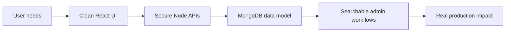

<div align="center">

# Hi, I'm Tanmay Dagur

### Full Stack Developer | React, Next.js, Node.js, TypeScript

I build clean interfaces, secure APIs, and practical full-stack products that are meant to be used by real people.

[](https://git.io/typing-svg)

[](https://www.linkedin.com/in/tanmay-dagur-aa62b9374/)
[](mailto:tanmaydagur200@gmail.com)
[](https://github.com/TanmayDagur)

</div>

---

## What I Do

```ts
const tanmay = {
  role: "Full Stack Developer",
  location: "New Delhi, India",
  focus: ["production dashboards", "secure REST APIs", "full-stack products"],
  currentlyBuilding: "React + Node.js + MongoDB apps for real users",
  learningNext: ["system design", "cloud", "DevOps"],
};
```

- Working as a **Full Stack Developer at Corporate Marriage Bureau**.
- Built a responsive admin dashboard that improved profile management time by **about 40%**.
- Developed **10+ JWT-secured backend APIs** for CRUD workflows across **500+ staff profiles**.
- Designed MongoDB schemas with practical search and filter support for **500+ live records**.

---

## Tech I Use

<div align="center">

| Frontend | Backend | Database | Tools |
| --- | --- | --- | --- |
| React.js | Node.js | PostgreSQL | Git |
| Next.js | Express.js | MongoDB | GitHub |
| Vite | TypeScript | Prisma ORM | Docker |
| Tailwind CSS | Hono |  | WSL |
|  | REST APIs |  | Turborepo |
|  | JWT Auth |  | Cloudflare Workers |
|  | Zod |  |  |

</div>

<div align="center">


</div>

---

## Featured Builds

### [Paytm-Style Digital Wallet](https://github.com/TanmayDagur/Paytm-wallet)

**React.js | Next.js | TypeScript | Prisma | PostgreSQL | Tailwind CSS**

A peer-to-peer wallet system with account creation, wallet top-ups, protected routes, and user-to-user transfers.

- Secured sessions with JWT auth and route protection, reducing access issues by **50%**.
- Logged **100% of transactions** with status, timestamps, and rollback-friendly data.
- Improved feedback and stability with stronger error handling, reducing crashes by **40%**.

### [AI Image Generation App](https://github.com/TanmayDagur/Image-Genration)

**Next.js App Router | TypeScript | Tailwind CSS | Hugging Face Inference API**

A dark-mode AI image generator with secure server-side inference and smooth image rendering.

- Kept API tokens safe with a server-side Next.js API route.
- Converted binary image data to Base64 for reliable frontend rendering.
- Added real-time inference status, route error handling, and an image modal.

### [Medium-Style Blogging Platform](https://github.com/TanmayDagur/Medium_clone)

**React.js | TypeScript | Vite | Tailwind CSS | Hono | Cloudflare Workers**

An edge-deployed blogging platform built during 100xDevs training.

- Created a rich blog editor with image metadata, improving content creation speed by **2x**.
- Integrated JWT-secured APIs and improved dashboard load time by **30%**.
- Used Zod validation across REST APIs, reaching **95% validation accuracy**.

### [Developer Portfolio](https://github.com/TanmayDagur/Portfolio)

**TypeScript | Modern frontend UI**

A personal portfolio project that brings my work, profile, and frontend style into one place.

---

## Experience Snapshot

### Full Stack Developer, Corporate Marriage Bureau

**New Delhi | Jun 2025 - Present**

Working across frontend and backend features with **React.js, Tailwind CSS, TypeScript, Node.js, Express.js, and MongoDB**.



---

## GitHub Activity

<div align="center">


</div>

---

## Education & Certifications

- **B.Tech in Computer Science**, Bikaner Technical University, Rajasthan
- **Full Stack Web Development**, 100xDevs
- **Web Designing**, Acme Embedded Technologies
- **Full Stack Intern**, Corporate Marriage Bureau

---

## Let's Connect

I like building full-stack products with clear UX, dependable APIs, and enough polish that the details feel intentional. If you are working on a product, dashboard, AI app, or backend-heavy feature, I would be happy to connect.

<div align="center">

[](https://www.linkedin.com/in/tanmay-dagur-aa62b9374/)
[](mailto:tanmaydagur200@gmail.com)


</div>
